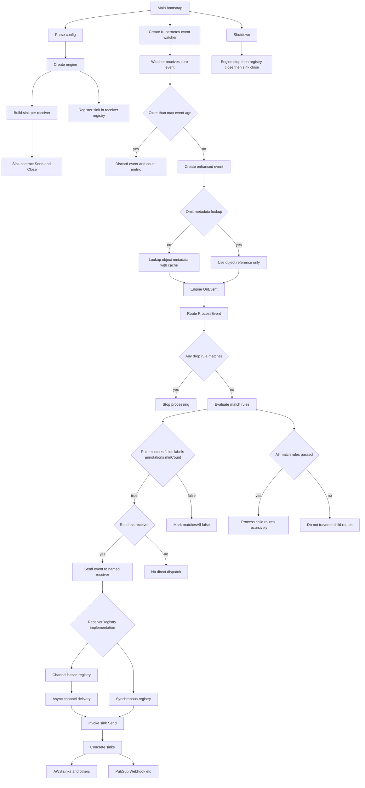

# Architecture

A high-level flowchart showing how events flow from the Kubernetes watcher through the routing engine to configured sinks.

```mermaid
flowchart TD
    A[Main bootstrap] --> B[Parse config]
    B --> C[Create engine]
    C --> D[Build sink per receiver]
    D --> E[Sink contract Send and Close]
    C --> F[Register sink in receiver registry]

    A --> G[Create Kubernetes event watcher]
    G --> H[Watcher receives core event]
    H --> H1{Older than max event age}
    H1 -- yes --> HX[Discard event and count metric]
    H1 -- no --> H2[Create enhanced event]
    H2 --> H3{Omit metadata lookup}
    H3 -- no --> H4[Lookup object metadata with cache]
    H3 -- yes --> H5[Use object reference only]
    H4 --> I[Engine OnEvent]
    H5 --> I

    I --> J[Route ProcessEvent]

    J --> K{Any drop rule matches}
    K -- yes --> K1[Stop processing]
    K -- no --> L[Evaluate match rules]

    L --> M{Rule matches fields labels annotations minCount}
    M -- true --> N{Rule has receiver}
    N -- yes --> O[Send event to named receiver]
    N -- no --> P[No direct dispatch]
    M -- false --> Q[Mark matchesAll false]

    L --> R{All match rules passed}
    R -- yes --> S[Process child routes recursively]
    R -- no --> T[Do not traverse child routes]

    O --> U{ReceiverRegistry implementation}
    U --> U1[Channel based registry]
    U --> U2[Synchronous registry]

    U1 --> V[Async channel delivery]
    V --> W[Invoke sink Send]
    U2 --> W

    W --> X[Concrete sinks]
    X --> X1[AWS sinks and others]
    X --> X2[PubSub Webhook etc]

    A --> Y[Shutdown]
    Y --> Z[Engine stop then registry close then sink close]
```
