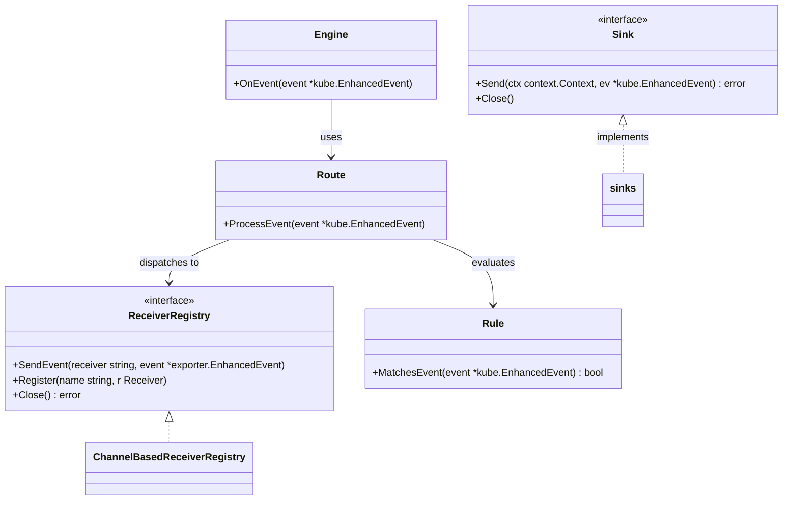
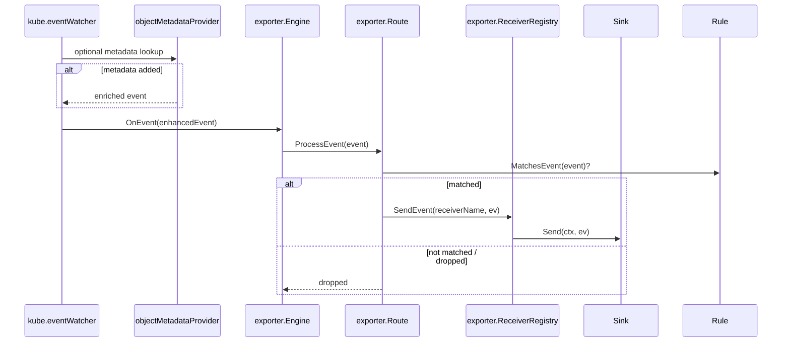

# Contracts (interfaces) and Sequence

This document contains two Mermaid diagrams describing the main contracts (interfaces) used by the exporter and a sequence diagram showing an event's path from watcher to sink.

## Interfaces-only (class diagram)

## Event flow (sequence diagram)

